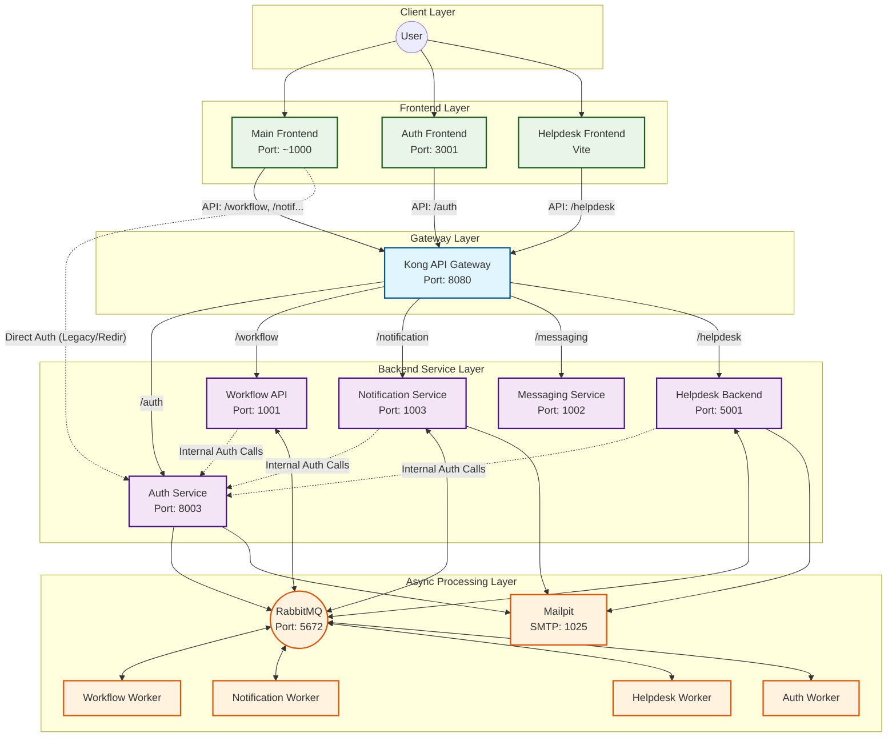

# TTS Ecosystem Architecture (Kong Gateway Variant)

This document outlines the architecture of the TTS (Ticket Tracking System) ecosystem when running with the Kong API Gateway configuration (`tts-ecosystem-kong.config.js`).

## Overview

In this configuration, **Kong** serves as the central API Gateway (Port 8080), handling request routing, rate limiting, and CORS for the backend services. While some services communicate directly (e.g., internal service-to-service calls to Auth), the primary ingress for frontend applications is through Kong.

### Key Architectural Patterns
*   **Gateway Pattern:** All frontend API requests are routed through Kong (`http://localhost:8080`).
*   **Service-Oriented:** Distinct services for Auth, Workflow, Notification, Messaging, and Helpdesk.
*   **Asynchronous Processing:** Heavy lifting is offloaded to Celery workers via RabbitMQ.
*   **Edge Authentication:** Services are configured to trust Kong (`KONG_TRUSTED=true`), relying on the gateway to handle initial JWT validation/routing (reading from cookies).

## Service Map

| Service | Local Port | Kong Route | Type | Description |
| :--- | :--- | :--- | :--- | :--- |
| **Kong Gateway** | `8080` | N/A | Gateway | Central ingress point. Routes requests to backends. |
| **Auth Service** | `8003` | `/auth`* | Backend | User management and authentication. *Accessed directly by internal services.* |
| **Workflow API** | `1001` | `/workflow` | Backend | Core logic for tickets and workflows. |
| **Notification Service** | `1003` | `/notification` | Backend | Real-time notifications (WebSocket + HTTP). |
| **Messaging Service** | `1002` | `/messaging` | Backend | Chat and messaging functionality. |
| **Helpdesk Backend** | `5001` | `/helpdesk` | Backend | Dedicated backend for the Helpdesk domain. |
| **Auth Worker** | N/A | N/A | Worker | Handles background auth synchronization tasks. |
| **Main Frontend** | `1000`* | N/A | Frontend | Primary user interface. (*Port inferred from CORS*) |
| **Auth Frontend** | `3001` | N/A | Frontend | Standalone login/registration UI. |

## Data Flow Diagram

## Configuration Details

### Environment Variable Highlights
The ecosystem is orchestrated via `PM2` using the configuration file. Key environment variables injected into services include:

*   **`KONG_TRUSTED="true"`**: Tells backend services to trust JWTs forwarded by Kong (often read from cookies) without re-validating the signature against the issuer strictly if the gateway has already done so, or to accept the specific headers Kong adds.
*   **`DJANGO_ALLOWED_HOSTS`**: Updated to include `localhost`, `127.0.0.1`, and service names to allow internal Docker/PM2 networking.
*   **Service URLs**:
    *   `VITE_API_BASE_URL` (Auth Frontend) -> `http://localhost:8080` (Kong)
    *   `VITE_WORKFLOW_API` (Main Frontend) -> `http://localhost:8080/workflow` (Kong)
    *   `DJANGO_AUTH_SERVICE_URL` -> `http://localhost:8003` (Direct, usually for server-side validation).

### Workers
*   **Auth Worker**: Handles `auth-sync-queue`.
*   **Workflow Worker**: Handles `role_send-default`, `TICKET_TASKS_PRODUCTION`, etc.
*   **Notification Worker**: Handles `notification-queue`, `inapp-notification-queue`.
*   **Helpdesk Worker**: Handles `hdts.user.sync`, `ticket_tasks2`, etc.

### Infrastructure Dependencies
*   **RabbitMQ**: Required for Celery (Task Queue).
*   **Mailpit**: Captures all outgoing emails (SMTP) for development/testing.
*   **Kong**: Must be started separately via Docker (`Scripts/cli/index.js run docker:kong`) before starting this ecosystem.
