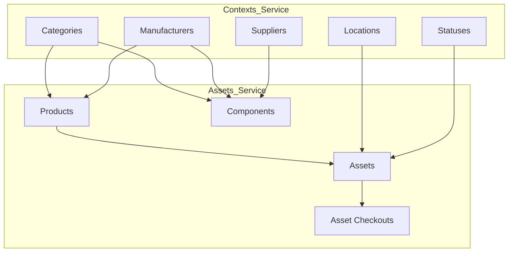

# AMS Seeding Logic Analysis

This document analyzes the database seeding architecture within the Asset Management System (AMS).

## Overview

Seeding in AMS is **decentralized**. Each microservice (`assets`, `contexts`) maintains its own set of Django management commands for seeding data. There is no single "global" seed command that populates the entire system across all services; instead, services must be seeded in a specific order due to data dependencies.

## Service-Specific Seeding

### 1. Contexts Service
**Role:** Provides foundational data (Categories, Manufacturers, Locations, etc.) referenced by other services.
**Location:** `ams/backend/contexts/contexts_ms/management/commands/`
**Primary Command:** `seed_all_contexts`

**Available Commands:**
*   `seed_all_contexts` (Orchestrator)
*   `seed_categories`
*   `seed_manufacturers`
*   `seed_suppliers`
*   `seed_locations`
*   `seed_statuses`
*   `seed_depreciations`
*   `seed_employees`
*   `seed_tickets`

**Key Characteristics:**
*   **Independent:** Does not require data from other services.
*   **Pre-requisite:** Must be run **BEFORE** the Assets service seeding.

### 2. Assets Service
**Role:** Manages tangible items (Assets, Components, Products).
**Location:** `ams/backend/assets/assets_ms/management/commands/`
**Primary Command:** `seed_all`

**Available Commands:**
*   `seed_all` (Orchestrator)
*   `seed_products`
*   `seed_assets`
*   `seed_components`
*   `seed_components_bulk`
*   `seed_asset_checkouts`
*   `seed_repairs`

**Key Characteristics:**
*   **Dependent:** Relies on Foreign Keys (IDs) existing in the Contexts service.
    *   *Example:* Creating a Component requires a valid `category_id`, `manufacturer_id`, etc.
*   **Orchestration Script:** `ams/seed.ps1` (and `seed.sh`) facilitates running these commands inside the `assets-service` container.

### 3. Authentication Service
**Role:** User management.
**Status:** No explicit custom seeding commands found in `auth_service`. Data is likely managed via standard Django superuser creation or fixtures if any.

## Dependency Graph



## Recommended Seeding Workflow

To correctly seed the entire AMS system, the following order must be observed:

1.  **Seed Contexts**:
    ```bash
    docker exec -it contexts-service python manage.py seed_all_contexts --clear
    ```
    *Ensures all reference IDs (1-10 usually) exist.*

2.  **Seed Assets**:
    *   **Option A (Script):** Run `.\ams\seed.ps1` and choose "Seed All Data".
    *   **Option B (Manual):**
        ```bash
        docker exec -it assets-service python manage.py seed_all --clear
        ```

## Observations & Potential Issues
*   **Hardcoded Dependencies:** The Assets seeders likely assume specific IDs (e.g., Category ID 1 is "RAM"). If Contexts are seeded differently (e.g., dynamic IDs), Assets seeding might fail or link to wrong data.
*   **No Cross-Service Orchestration:** The provided `seed.ps1` only talks to `assets-service`. It does *not* trigger seeding in `contexts-service`. A user running just `seed.ps1` on a fresh install will likely encounter Foreign Key errors.
