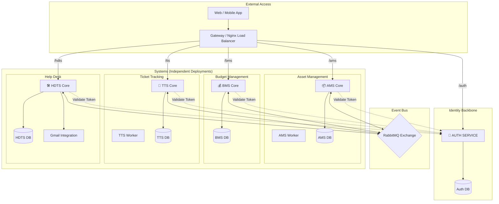

# System Architecture

The MAP Industry Platform uses a **System of Systems** architecture with a centralized Identity Backbone and Event Bus.

## High-Level Topology



## Integration Patterns

### 1. Synchronous (REST API)

Direct HTTP calls between services using internal Docker network hostnames:

```
┌─────────────┐     HTTP/REST      ┌─────────────┐
│ TTS Service │ ─────────────────► │ Auth Service│
│  :8003      │   /api/v1/tts/     │    :8000    │
└─────────────┘   round-robin/     └─────────────┘
```

**Use Cases:**
- Token validation
- User info lookup (`/api/v1/tts/user-info/{id}/`)
- Role-based user assignment (round-robin)

### 2. Asynchronous (Event Bus)

RabbitMQ-based messaging with Celery task queues:

```
┌─────────────┐    Celery Task     ┌─────────────┐     Consume      ┌─────────────┐
│ Ticket Svc  │ ─────────────────► │  RabbitMQ   │ ───────────────► │ Workflow    │
└─────────────┘   TICKET_TASKS     └─────────────┘                  │   Worker    │
                                                                     └─────────────┘
```

**Use Cases:**
- Ticket workflow processing
- Notification delivery
- User sync across systems

## Service Discovery

| Service | Internal URL | External Port |
|---------|--------------|---------------|
| Auth | `http://auth-service:8000` | 8000 |
| AMS | `http://ams-backend:8001` | 8001 |
| BMS | `http://bms-service:8002` | 8002 |
| TTS | `http://ticket-service:8003` | 8003 |
| HDTS | `http://hdts-backend:8004` | 8004 |

## Database Strategy

Each system maintains its own PostgreSQL database for data isolation:

| System | Database | Purpose |
|--------|----------|---------|
| Auth | `auth_db` | Users, roles, systems, API keys |
| AMS | `ams_db` | Assets, categories, transactions |
| BMS | `bms_db` | Budgets, proposals, reports |
| TTS | `tts_db` | Tickets, workflows, SLAs |
| HDTS | `hdts_db` | Employee tickets, email mappings |