# Hub-and-Spoke Authentication

The **Auth System** acts as the centralized Identity Provider (IdP) for all downstream systems (AMS, BMS, TTS, HDTS).

## Authentication Architecture

```mermaid
sequenceDiagram
    participant User
    participant Frontend
    participant Auth as Auth Service
    participant System as AMS/BMS/TTS
    
    User->>Frontend: Enter credentials
    Frontend->>Auth: POST /api/v1/users/login/api/
    Auth->>Auth: Validate credentials
    alt 2FA Enabled
        Auth-->>Frontend: 200 (2FA Required)
        Frontend->>User: Enter OTP
        User->>Frontend: Submit OTP
        Frontend->>Auth: POST /api/v1/users/login/verify-otp/
    end
    Auth-->>Frontend: Set HttpOnly cookies (access_token, refresh_token)
    Frontend->>System: Request with cookies
    System->>System: Validate JWT from cookie
    System-->>Frontend: Protected resource
```



## Dual-User Model

The platform supports two distinct user types with separate authentication flows:

### Staff Users
- **Target:** Internal users (Admins, Managers, Technicians)
- **Credentials:** Email + Password + Optional 2FA
- **Endpoint:** `POST /api/v1/users/login/api/`
- **Redirect:** System-specific dashboards based on assigned roles

### Employee Users (HDTS)
- **Target:** External employees submitting help desk tickets
- **Credentials:** Email + Password (approval required)
- **Endpoint:** `POST /api/v1/hdts/employees/api/login/`
- **Redirect:** Employee profile/ticket portal

## Token Strategy

| Aspect | Implementation |
|--------|---------------|
| **Format** | JWT (JSON Web Tokens) |
| **Algorithm** | HS256 |
| **Storage** | HttpOnly, Secure, SameSite=Lax cookies |
| **Access Token TTL** | 15 minutes |
| **Refresh Token TTL** | 7 days |
| **Rotation** | Refresh tokens rotate on use; old ones blacklisted |

### JWT Claims

```json
{
  "user_id": 123,
  "user_type": "staff",
  "roles": ["Admin", "Manager"],
  "systems": ["TTS", "AMS"],
  "exp": 1735689600,
  "iat": 1735688700
}
```

## Token Validation by Downstream Systems

Each system validates tokens using the shared JWT signing key:

1. Extract `access_token` from cookie or `Authorization: Bearer` header
2. Verify signature using `DJANGO_JWT_SIGNING_KEY`
3. Check expiration (`exp` claim)
4. Load user from `user_id` claim
5. Authorize based on `systems` and `roles` claims

## Session Management

- **Staff routes:** JWT-only authentication (sessions invalidated)
- **Superadmin routes:** Django sessions allowed for admin portal
- **Cross-system:** Cookies shared via same domain/subdomain
