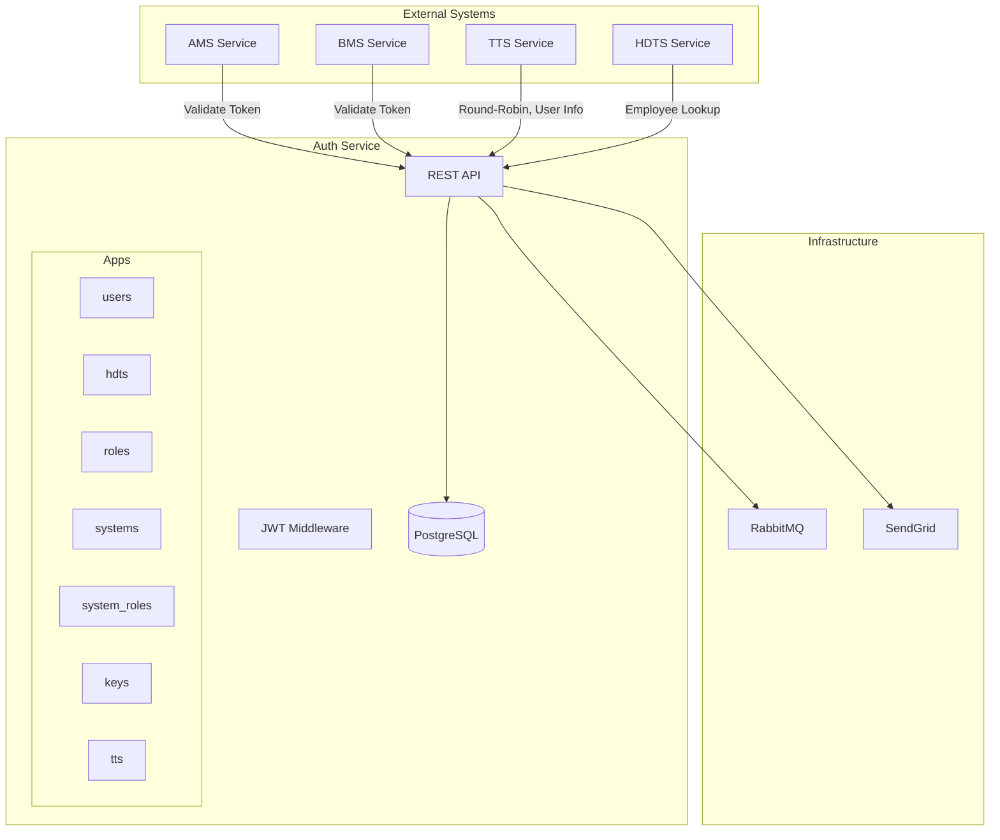
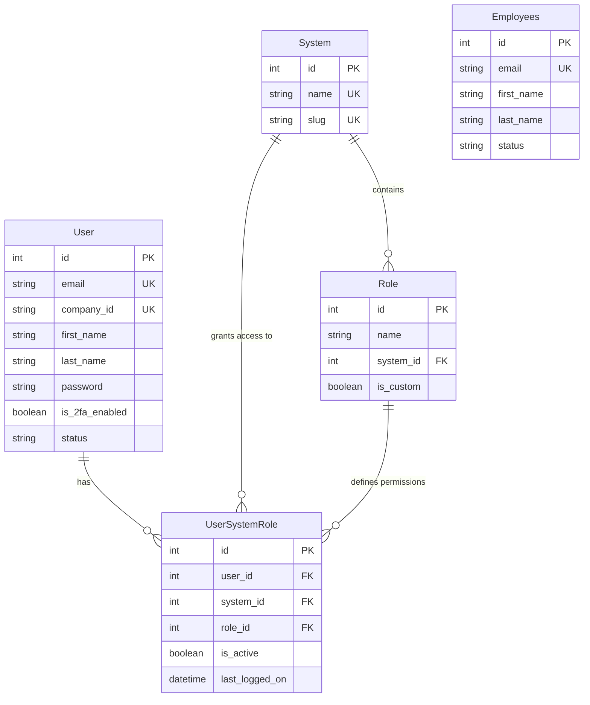

# Architecture & Tech Stack

## Executive Summary

The **Authentication Service** (`auth`) is the centralized Identity Provider (IdP) for the entire MAP Industry Platform. It manages identities for **Staff** (Admins, Managers, Technicians) and **Employees** (End-users), handling authentication, authorization, session management via secure cookies, and role-based access control (RBAC) across multiple downstream systems.

## System Context



## Technology Stack

| Layer | Technology | Purpose |
|-------|------------|---------|
| **Framework** | Django 5.x | Web framework |
| **API** | Django REST Framework | RESTful endpoints |
| **Database** | PostgreSQL / SQLite | Data persistence |
| **Auth** | SimpleJWT | JWT token management |
| **Task Queue** | Celery + RabbitMQ | Async tasks |
| **Email** | SendGrid | Transactional emails |
| **Docs** | drf-spectacular | OpenAPI 3.0 schema |

## Key Modules (Apps)

| App | Purpose | Key Models |
|-----|---------|------------|
| **`users`** | Staff identity, profiles, 2FA, authentication | `User` |
| **`hdts`** | Employee (end-user) identity management | `Employees` |
| **`roles`** | Role definitions per system | `Role` |
| **`systems`** | Downstream system registry | `System` |
| **`system_roles`** | User ↔ System ↔ Role mappings | `UserSystemRole` |
| **`keys`** | API key management | `APIKey` |
| **`tts`** | TTS-specific integration endpoints | (views only) |
| **`emails`** | Email service abstraction | (service layer) |

## Data Model



## URL Structure

```
/                           → Redirect to /staff/login/
/admin/                     → Django admin (superusers)
/superadmin/                → Superuser management portal
/staff/                     → Staff portal (login, settings)
/login/                     → Employee login (HDTS)
/api/                       → API root
/api/v1/                    → API v1 endpoints
  ├── users/                → Staff authentication & profiles
  ├── roles/                → Role management
  ├── systems/              → System registry
  ├── system-roles/         → User-System-Role assignments
  ├── tts/                  → TTS integrations
  └── hdts/                 → Employee/HDTS endpoints
```

## Port Allocation

| Environment | Port | URL |
|-------------|------|-----|
| Development | 8000 | `http://localhost:8000` |
| Docker | 8000 | `http://auth-service:8000` |
| Production | 8000 | Behind reverse proxy |
