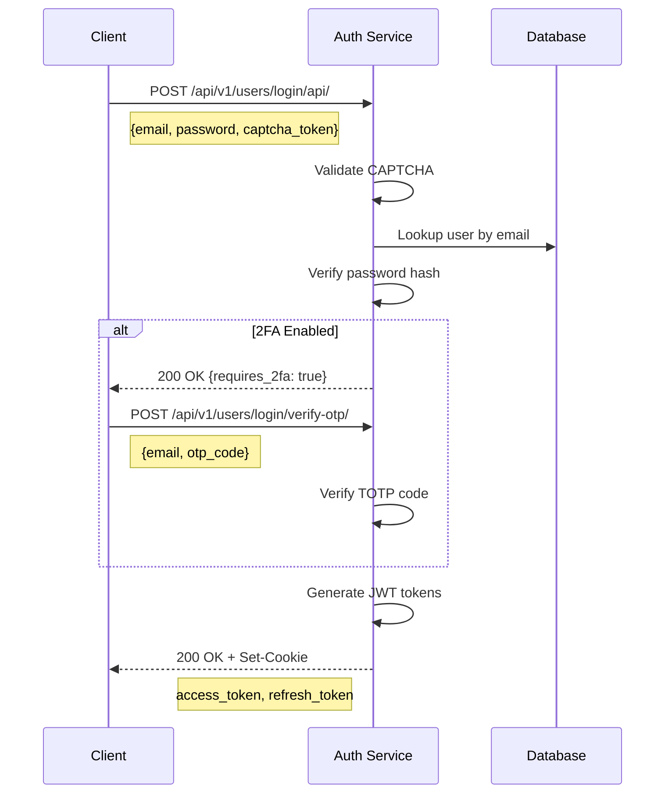
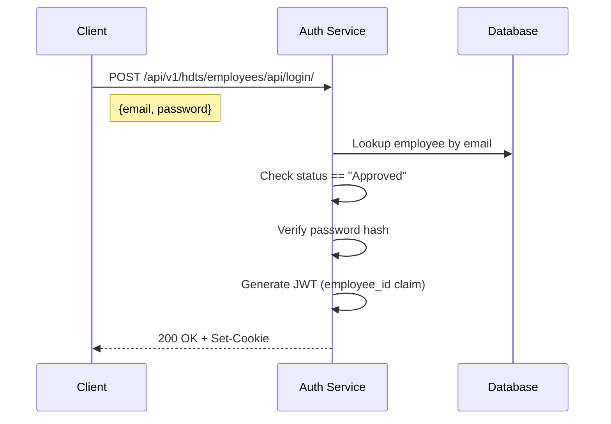
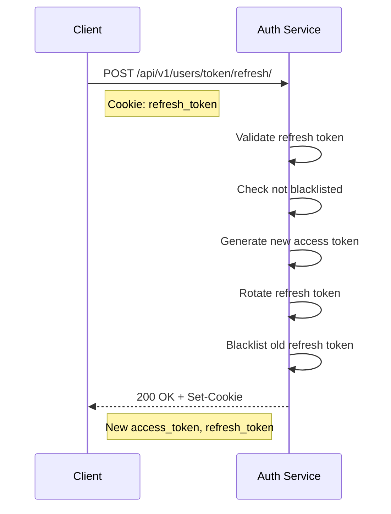

# Authentication Mechanisms

The service implements a **Dual-User Model** with distinct authentication flows but unified token protection.

## Staff Authentication (`users` app)

### Overview
- **Target:** Internal users (Admins, Managers, Technicians)
- **Credentials:** Email + Password + Optional 2FA
- **Endpoint:** `POST /api/v1/users/login/api/`

### Login Flow



### API Endpoints

| Method | Endpoint | Description |
|--------|----------|-------------|
| `POST` | `/api/v1/users/login/api/` | Initial login |
| `POST` | `/api/v1/users/login/verify-otp/` | 2FA verification |
| `POST` | `/api/v1/users/register/` | New user registration |
| `POST` | `/api/v1/users/token/refresh/` | Refresh access token |
| `POST` | `/api/v1/users/logout/` | Clear tokens |

## Employee Authentication (`hdts` app)

### Overview
- **Target:** External employees submitting help desk tickets
- **Credentials:** Email + Password
- **Endpoint:** `POST /api/v1/hdts/employees/api/login/`
- **Requirement:** Account must be in "Approved" status

### Login Flow



### API Endpoints

| Method | Endpoint | Description |
|--------|----------|-------------|
| `POST` | `/api/v1/hdts/employees/api/login/` | Employee login |
| `POST` | `/api/v1/hdts/employees/api/register/` | Employee registration |
| `GET` | `/api/v1/hdts/employees/api/profile/` | Get current profile |

## Token Management (JWT)

### Token Specifications

| Aspect | Staff Tokens | Employee Tokens |
|--------|--------------|-----------------|
| **Algorithm** | HS256 | HS256 |
| **Signing Key** | `DJANGO_JWT_SIGNING_KEY` | `DJANGO_JWT_SIGNING_KEY` |
| **Access TTL** | 15 minutes | 15 minutes |
| **Refresh TTL** | 7 days | 7 days |
| **Key Claim** | `user_id` | `employee_id` |

### Cookie Settings

```python
{
    "httponly": True,      # Prevent XSS access
    "secure": True,        # HTTPS only (production)
    "samesite": "Lax",     # CSRF protection
    "path": "/",           # Available to all paths
    "max_age": 604800      # 7 days for refresh token
}
```

### JWT Claims (Staff)

```json
{
  "token_type": "access",
  "exp": 1735689600,
  "iat": 1735688700,
  "jti": "unique-token-id",
  "user_id": 123,
  "user_type": "staff",
  "email": "admin@example.com",
  "roles": ["Admin"],
  "systems": ["TTS", "AMS"]
}
```

### JWT Claims (Employee)

```json
{
  "token_type": "access",
  "exp": 1735689600,
  "iat": 1735688700,
  "employee_id": 456,
  "user_type": "employee",
  "email": "employee@company.com"
}
```

## Token Refresh Flow



## Two-Factor Authentication (2FA)

### Setup Flow

1. User calls `POST /api/v1/users/2fa/request-otp/` - receives OTP via email
2. User calls `POST /api/v1/users/2fa/enable/` with OTP code
3. 2FA flag set on user account

### Available Endpoints

| Method | Endpoint | Description |
|--------|----------|-------------|
| `POST` | `/api/v1/users/2fa/request-otp/` | Request OTP code |
| `POST` | `/api/v1/users/2fa/enable/` | Enable 2FA |
| `POST` | `/api/v1/users/2fa/disable/` | Disable 2FA |

## CAPTCHA Protection

Login endpoints are protected by CAPTCHA after failed attempts:

```python
# Request body includes captcha
{
    "email": "user@example.com",
    "password": "secret",
    "captcha_token": "generated-captcha-response"
}
```

| Method | Endpoint | Description |
|--------|----------|-------------|
| `POST` | `/api/v1/users/captcha/generate/` | Generate CAPTCHA |
| `POST` | `/api/v1/users/captcha/verify/` | Verify CAPTCHA |
| `GET` | `/api/v1/users/captcha/required/` | Check if CAPTCHA needed |
