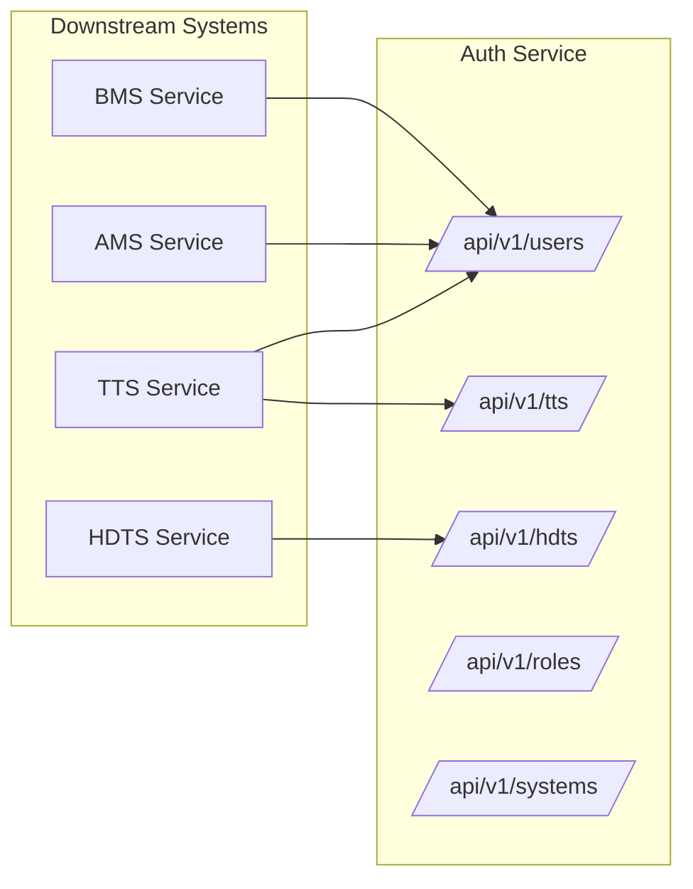

# Integration Points

This document provides a comprehensive reference for all integration endpoints and patterns between the Auth Service and downstream systems.

## Integration Overview



## TTS Integration Endpoints

The `/api/v1/tts/` namespace provides specialized endpoints for Ticket Tracking System integration.

### Round-Robin User Assignment

Fetch users by role for automatic ticket assignment.

```http
GET /api/v1/tts/round-robin/?system=TTS&role=Technician
Authorization: Bearer <access_token>
```

**Response:**
```json
{
  "user_ids": [1, 5, 12, 23],
  "system": "TTS",
  "role": "Technician",
  "count": 4
}
```

**Use Case:** Distribute tickets evenly among available technicians.

---

### Single User Info

Fetch detailed user information by ID.

```http
GET /api/v1/tts/user-info/123/
Authorization: Bearer <access_token>
```

**Response:**
```json
{
  "id": 123,
  "email": "technician@example.com",
  "first_name": "John",
  "last_name": "Doe",
  "company_id": "MA0015",
  "profile_pic": "/media/profile_pics/123.jpg",
  "department": "IT Department",
  "is_active": true,
  "system_roles": [
    {
      "system": "TTS",
      "system_slug": "TTS",
      "role": "Technician",
      "is_active": true
    }
  ]
}
```

---

### Batch User Info

Fetch multiple users in a single request.

```http
POST /api/v1/tts/users-info/
Authorization: Bearer <access_token>
Content-Type: application/json

{
  "user_ids": [1, 5, 12, 23]
}
```

**Response:**
```json
{
  "users": [
    {"id": 1, "email": "user1@example.com", "first_name": "User", "last_name": "One"},
    {"id": 5, "email": "user5@example.com", "first_name": "User", "last_name": "Five"},
    // ...
  ],
  "not_found": []
}
```

---

### Role Assignment

Assign a user to a role within a system.

```http
POST /api/v1/tts/assign-agent-to-role/
Authorization: Bearer <access_token>
Content-Type: application/json

{
  "user_id": 123,
  "system_slug": "TTS",
  "role_name": "Technician"
}
```

**Response:**
```json
{
  "id": 456,
  "user_id": 123,
  "system": "TTS",
  "role": "Technician",
  "is_active": true,
  "assigned_at": "2024-12-27T10:30:00Z"
}
```

---

## HDTS Integration Endpoints

The `/api/v1/hdts/` namespace provides endpoints for Help Desk Ticket System integration.

### Internal Employee Lookup

Fetch employee details for ticket attribution (no user auth required, API key only).

```http
GET /api/v1/hdts/employees/internal/456/
X-API-Key: your-api-key
```

**Response:**
```json
{
  "id": 456,
  "email": "employee@company.com",
  "first_name": "Jane",
  "last_name": "Smith",
  "status": "Approved",
  "created_at": "2024-01-15T08:00:00Z"
}
```

---

### Employee Profile by ID

Fetch employee profile with read-only access.

```http
GET /api/v1/hdts/users/456/
Authorization: Bearer <access_token>
```

---

### Pending User Management

List employees pending approval.

```http
GET /api/v1/hdts/user-management/pending/api/
Authorization: Bearer <access_token>
```

**Response:**
```json
{
  "count": 3,
  "results": [
    {
      "id": 789,
      "email": "pending@company.com",
      "first_name": "New",
      "last_name": "Employee",
      "status": "Pending",
      "created_at": "2024-12-26T14:00:00Z"
    }
  ]
}
```

---

## User & Profile Endpoints

General user endpoints consumed by multiple systems.

### Token Validation

Verify if a token is valid.

```http
GET /api/v1/users/token/validate/
Authorization: Bearer <access_token>
```

**Response (200 OK):**
```json
{
  "valid": true,
  "user_id": 123,
  "user_type": "staff",
  "expires_at": "2024-12-27T11:00:00Z"
}
```

---

### Current User Profile

Get authenticated user's profile.

```http
GET /api/v1/users/profile/
Authorization: Bearer <access_token>
```

---

### User by Company ID

Lookup user by their company ID.

```http
GET /api/v1/users/profile/by-company/MA0015/
Authorization: Bearer <access_token>
```

---

## Internal Endpoints (Service-to-Service)

These endpoints are designed for internal service communication and require API key authentication.

### User Details (Internal)

```http
GET /api/v1/users/internal/123/
X-API-Key: your-api-key
```

**Security:** Should only be accessible from within the trusted network. No user authentication required.

---

## Event-Based Integration

For asynchronous communication, the Auth Service publishes events to RabbitMQ.

### Published Events

| Event | Queue | Payload | Trigger |
|-------|-------|---------|---------|
| `user.created` | `USER_SYNC` | User details | New user registration |
| `user.updated` | `USER_SYNC` | User details | Profile update |
| `role.assigned` | `ROLE_SYNC` | Assignment details | UserSystemRole created |
| `role.removed` | `ROLE_SYNC` | Assignment ID | UserSystemRole deleted |

### Event Payload Example

```json
{
  "event": "user.created",
  "timestamp": "2024-12-27T10:30:00Z",
  "data": {
    "id": 123,
    "email": "newuser@example.com",
    "first_name": "New",
    "last_name": "User",
    "systems": ["TTS"],
    "roles": [{"system": "TTS", "role": "User"}]
  }
}
```

### Consuming Events (Celery Worker)

```python
from celery import shared_task

@shared_task(name='tts.tasks.handle_user_created')
def handle_user_created(user_data):
    # Sync user to local database
    User.objects.update_or_create(
        auth_id=user_data['id'],
        defaults={
            'email': user_data['email'],
            'first_name': user_data['first_name'],
            'last_name': user_data['last_name'],
        }
    )
```

---

## Authentication Headers

### Cookie-Based (Browser)

Tokens are automatically sent via cookies:
```
Cookie: access_token=eyJ...; refresh_token=eyJ...
```

### Header-Based (API Clients)

For non-browser clients:
```
Authorization: Bearer eyJ...
```

### API Key (Service-to-Service)

For internal endpoints:
```
X-API-Key: your-40-character-api-key
```

---

## Error Handling

### Standard Error Response

```json
{
  "detail": "Error message here",
  "code": "error_code"
}
```

### Common Error Codes

| Code | HTTP Status | Description |
|------|-------------|-------------|
| `not_authenticated` | 401 | No valid token provided |
| `token_expired` | 401 | Token has expired |
| `permission_denied` | 403 | Insufficient role/permissions |
| `not_found` | 404 | Resource not found |
| `validation_error` | 400 | Invalid request data |

---

## SDK Usage Examples

### Python (requests)

```python
import requests

AUTH_URL = "http://auth-service:8000"
API_KEY = "your-api-key"

class AuthClient:
    def __init__(self, base_url, api_key):
        self.base_url = base_url
        self.api_key = api_key
    
    def get_user(self, user_id):
        response = requests.get(
            f"{self.base_url}/api/v1/users/internal/{user_id}/",
            headers={"X-API-Key": self.api_key}
        )
        response.raise_for_status()
        return response.json()
    
    def get_users_by_role(self, system, role, access_token):
        response = requests.get(
            f"{self.base_url}/api/v1/tts/round-robin/",
            params={"system": system, "role": role},
            cookies={"access_token": access_token}
        )
        response.raise_for_status()
        return response.json()["user_ids"]

# Usage
client = AuthClient(AUTH_URL, API_KEY)
user = client.get_user(123)
technicians = client.get_users_by_role("TTS", "Technician", token)
```

### JavaScript (axios)

```javascript
import axios from 'axios';

const authClient = axios.create({
  baseURL: 'http://auth-service:8000',
  withCredentials: true, // Include cookies
});

// Get user by role
async function getUsersByRole(system, role) {
  const { data } = await authClient.get('/api/v1/tts/round-robin/', {
    params: { system, role }
  });
  return data.user_ids;
}

// Validate token
async function validateToken() {
  try {
    await authClient.get('/api/v1/users/token/validate/');
    return true;
  } catch {
    return false;
  }
}
```
