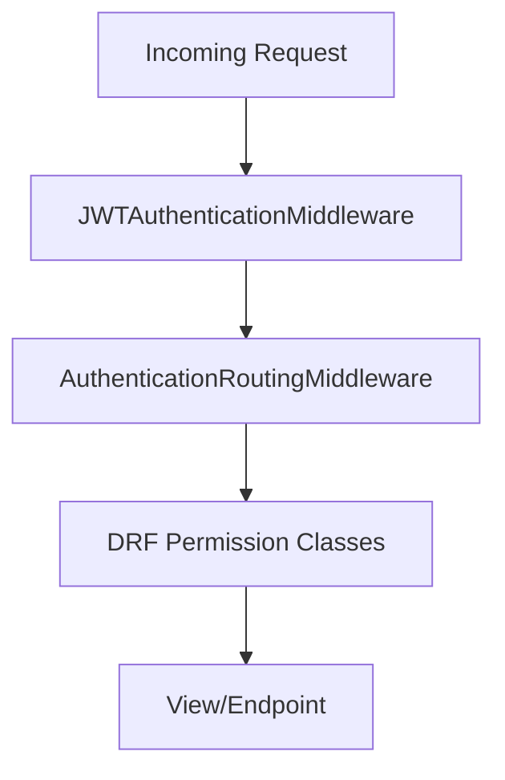

# Middleware & Security

The Auth Service implements multiple middleware layers for authentication, authorization, and route protection.

## Middleware Stack



## JWT Authentication Middleware

**Location:** `auth/middleware.py` → `JWTAuthenticationMiddleware`

### Functionality

1. **Token Extraction:** Checks `access_token` cookie first, then `Authorization: Bearer` header
2. **Token Decoding:** Attempts custom employee token format, then DRF SimpleJWT format
3. **User Loading:** Sets `request.user` (Staff) or `request.employee` (Employee)
4. **Session Invalidation:** Clears Django sessions for non-superadmin routes

### Code Flow

```python
class JWTAuthenticationMiddleware:
    def __call__(self, request):
        # 1. Extract token from cookie or header
        access_token = request.COOKIES.get('access_token')
        if not access_token:
            auth_header = request.META.get('HTTP_AUTHORIZATION', '')
            if auth_header.startswith('Bearer '):
                access_token = auth_header[7:]
        
        # 2. Try employee token first (has employee_id claim)
        employee_payload = self._decode_custom_token(access_token)
        if employee_payload and 'employee_id' in employee_payload:
            request.employee = Employees.objects.get(id=employee_payload['employee_id'])
            return self.get_response(request)
        
        # 3. Try staff token (SimpleJWT format)
        token = AccessToken(access_token)
        token.verify()
        request.user = User.objects.get(id=token['user_id'])
        
        return self.get_response(request)
```

### Request Attributes Set

| Attribute | Type | Description |
|-----------|------|-------------|
| `request.user` | `User` | Authenticated staff user |
| `request.employee` | `Employees` | Authenticated employee |

## Route Guard Middleware

**Location:** `users/authentication_middleware.py` → `AuthenticationRoutingMiddleware`

### Purpose

Implements route-level access control to prevent cross-user-type access:

| User Type | Allowed Routes | Blocked Routes |
|-----------|----------------|----------------|
| Staff | `/staff/*`, `/api/v1/users/*` | `/api/v1/hdts/*` (employee routes) |
| Employee | `/login/*`, `/api/v1/hdts/*` | `/staff/*`, `/api/v1/users/*` |
| Unauthenticated | Public routes only | All protected routes |

### Public Routes (Whitelisted)

```python
PUBLIC_PATHS = [
    '/staff/login/',
    '/login/',
    '/register/',
    '/api/docs/',
    '/api/schema/',
    '/admin/',
    '/static/',
    '/media/',
]
```

### Redirect Behavior

| Scenario | Action |
|----------|--------|
| Unauthenticated → Protected | Redirect to `/staff/login/` |
| Employee → Staff route | Redirect to `/login/` |
| Staff → Employee route | HTTP 403 Forbidden |
| Staff (1 system) → Login | Redirect to system dashboard |
| Staff (multiple systems) → Login | Redirect to system selection |

## Permission Classes

### `IsAuthenticated`
Standard DRF permission - requires valid JWT token.

### `AllowAny`
Public endpoints (registration, login, public system list).

### `IsSystemAdminOrSuperUser`

**Location:** `auth/permissions.py`

Custom permission for admin-only operations:

```python
class IsSystemAdminOrSuperUser(BasePermission):
    def has_permission(self, request, view):
        if not request.user or not request.user.is_authenticated:
            return False
        
        # Superusers always have access
        if request.user.is_superuser:
            return True
        
        # Check for Admin role in any system
        return UserSystemRole.objects.filter(
            user=request.user,
            role__name='Admin',
            is_active=True
        ).exists()
```

## Security Headers

Applied in production via Django settings:

```python
# settings.py (production)
SECURE_BROWSER_XSS_FILTER = True
SECURE_CONTENT_TYPE_NOSNIFF = True
X_FRAME_OPTIONS = 'DENY'
CSRF_COOKIE_SECURE = True
SESSION_COOKIE_SECURE = True
```

## CORS Configuration

```python
CORS_ALLOWED_ORIGINS = [
    "http://localhost:1000",    # TTS Frontend
    "http://localhost:3001",    # AMS Frontend
    "http://localhost:3002",    # BMS Frontend
]

CORS_ALLOW_CREDENTIALS = True  # Allow cookies
```

## Rate Limiting

Implemented via Django middleware for login endpoints:

| Endpoint | Limit | Window |
|----------|-------|--------|
| `/api/v1/users/login/*` | 5 attempts | 15 minutes |
| `/api/v1/hdts/employees/login/` | 5 attempts | 15 minutes |

After exceeding limits, CAPTCHA is required.
