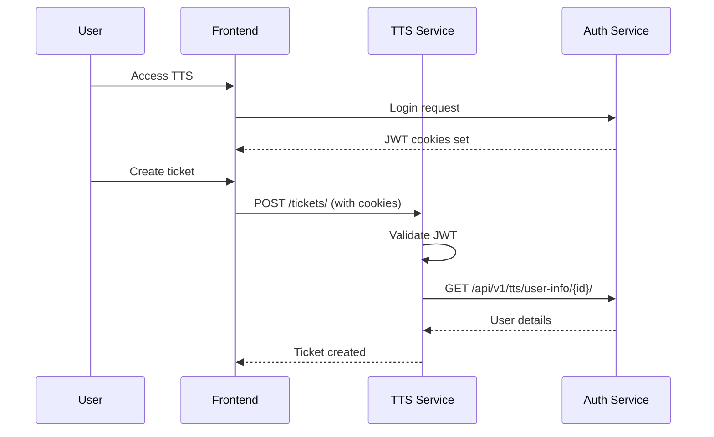

# System Integration Guide

This guide explains how downstream systems (AMS, BMS, TTS, HDTS) integrate with the Auth Service for authentication and authorization.

## Integration Architecture



## Token Validation

### Option 1: Local Validation (Recommended)

Validate tokens locally using the shared signing key:

```python
# settings.py
JWT_SIGNING_KEY = config('DJANGO_JWT_SIGNING_KEY')

# middleware.py
import jwt

def validate_token(request):
    token = request.COOKIES.get('access_token')
    if not token:
        return None
    
    try:
        payload = jwt.decode(
            token,
            JWT_SIGNING_KEY,
            algorithms=['HS256']
        )
        return payload
    except jwt.ExpiredSignatureError:
        return None
    except jwt.InvalidTokenError:
        return None
```

### Option 2: Remote Validation

Call Auth Service to validate (useful when key sharing is not possible):

```python
def validate_token_remote(access_token):
    response = requests.get(
        f"{AUTH_SERVICE_URL}/api/v1/users/token/validate/",
        cookies={"access_token": access_token}
    )
    return response.status_code == 200
```

## User Information Lookup

### Single User

```python
def get_user_info(user_id, access_token):
    response = requests.get(
        f"{AUTH_SERVICE_URL}/api/v1/tts/user-info/{user_id}/",
        cookies={"access_token": access_token}
    )
    return response.json()

# Response
{
    "id": 123,
    "email": "user@example.com",
    "first_name": "John",
    "last_name": "Doe",
    "company_id": "MA0001",
    "systems": ["TTS", "AMS"],
    "roles": [
        {"system": "TTS", "role": "Technician"},
        {"system": "AMS", "role": "User"}
    ]
}
```

### Batch Lookup

```python
def get_users_batch(user_ids, access_token):
    response = requests.post(
        f"{AUTH_SERVICE_URL}/api/v1/tts/users-info/",
        json={"user_ids": user_ids},
        cookies={"access_token": access_token}
    )
    return response.json()
```

## Role-Based User Assignment

For ticket routing and work distribution:

```python
def get_users_by_role(system, role, access_token):
    response = requests.get(
        f"{AUTH_SERVICE_URL}/api/v1/tts/round-robin/",
        params={"system": system, "role": role},
        cookies={"access_token": access_token}
    )
    data = response.json()
    return data.get("user_ids", [])

# Example: Get all TTS technicians
technicians = get_users_by_role("TTS", "Technician", token)
# Returns: [1, 5, 12, 23]
```

## Employee Lookup (HDTS)

For help desk ticket attribution:

```python
def get_employee_info(employee_id):
    # Internal endpoint - no user auth needed
    response = requests.get(
        f"{AUTH_SERVICE_URL}/api/v1/hdts/employees/internal/{employee_id}/",
        headers={"X-API-Key": API_KEY}
    )
    return response.json()
```

## Middleware Integration

### Django Middleware Example

```python
# your_service/middleware.py
import jwt
from django.conf import settings
from django.http import JsonResponse

class JWTAuthMiddleware:
    def __init__(self, get_response):
        self.get_response = get_response
    
    def __call__(self, request):
        # Skip auth for public routes
        if request.path.startswith('/public/'):
            return self.get_response(request)
        
        token = request.COOKIES.get('access_token')
        if not token:
            auth_header = request.META.get('HTTP_AUTHORIZATION', '')
            if auth_header.startswith('Bearer '):
                token = auth_header[7:]
        
        if not token:
            return JsonResponse(
                {"error": "Authentication required"},
                status=401
            )
        
        try:
            payload = jwt.decode(
                token,
                settings.JWT_SIGNING_KEY,
                algorithms=['HS256']
            )
            request.jwt_payload = payload
            request.user_id = payload.get('user_id')
            request.user_type = payload.get('user_type', 'staff')
        except jwt.InvalidTokenError:
            return JsonResponse(
                {"error": "Invalid token"},
                status=401
            )
        
        return self.get_response(request)
```

### Express.js Middleware Example

```javascript
// middleware/auth.js
const jwt = require('jsonwebtoken');

const JWT_SIGNING_KEY = process.env.JWT_SIGNING_KEY;

function authMiddleware(req, res, next) {
  const token = req.cookies.access_token || 
                req.headers.authorization?.replace('Bearer ', '');
  
  if (!token) {
    return res.status(401).json({ error: 'Authentication required' });
  }
  
  try {
    const payload = jwt.verify(token, JWT_SIGNING_KEY);
    req.user = payload;
    next();
  } catch (err) {
    return res.status(401).json({ error: 'Invalid token' });
  }
}

module.exports = authMiddleware;
```

## Configuration Checklist

For each downstream service:

- [ ] Set `DJANGO_JWT_SIGNING_KEY` (must match Auth Service)
- [ ] Set `AUTH_SERVICE_URL` for API calls
- [ ] Set `AUTH_API_KEY` for internal endpoints
- [ ] Configure CORS to allow Auth Service origin
- [ ] Add JWT middleware to request pipeline
- [ ] Handle token refresh on 401 responses

## Environment Variables

```bash
# Required for all downstream services
DJANGO_JWT_SIGNING_KEY=your-shared-signing-key
AUTH_SERVICE_URL=http://auth-service:8000
AUTH_API_KEY=your-api-key-for-internal-calls

# Optional
JWT_ALGORITHM=HS256
TOKEN_REFRESH_THRESHOLD=300  # seconds before expiry to refresh
```

## Error Handling

| Status Code | Meaning | Action |
|-------------|---------|--------|
| 401 | Token expired/invalid | Redirect to login or refresh token |
| 403 | Insufficient permissions | Show access denied message |
| 404 | User not found | Handle gracefully |
| 503 | Auth service unavailable | Show maintenance message, retry |

```python
def handle_auth_error(response):
    if response.status_code == 401:
        # Token expired - try refresh
        return redirect_to_login()
    elif response.status_code == 403:
        raise PermissionDenied("Insufficient permissions")
    elif response.status_code >= 500:
        # Auth service down - use cached data or fail gracefully
        logger.error("Auth service unavailable")
        raise ServiceUnavailable()
```
