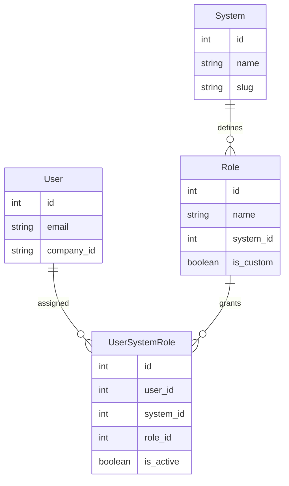

# User Roles & Permissions

The Auth Service implements a flexible Role-Based Access Control (RBAC) system that allows users to have different roles across different systems.

## Role Model

Roles are defined per-system, allowing each downstream system to have its own role hierarchy.



## Default Roles Per System

### TTS (Ticket Tracking System)

| Role | Description | Permissions |
|------|-------------|-------------|
| **Admin** | System administrator | Full access, user management |
| **Manager** | Team manager | View all tickets, reassign, reports |
| **Technician** | Technical staff | Handle assigned tickets, update status |
| **User** | Regular user | Submit tickets, view own tickets |

### AMS (Asset Management System)

| Role | Description | Permissions |
|------|-------------|-------------|
| **Admin** | Asset administrator | Full access, asset CRUD |
| **Manager** | Asset manager | Approve check-in/out, reports |
| **User** | Regular user | Request assets, view assignments |

### BMS (Budget Management System)

| Role | Description | Permissions |
|------|-------------|-------------|
| **Admin** | Budget administrator | Full access |
| **Approver** | Budget approver | Approve/reject proposals |
| **User** | Budget requester | Submit proposals |

### HDTS (Help Desk)

Employees use a separate model without traditional roles - access is controlled by approval status.

## Role Assignment

### Via API

```bash
POST /api/v1/system-roles/
Content-Type: application/json

{
  "user": 123,
  "system": 1,
  "role": 2,
  "is_active": true
}
```

### Via Admin Portal

1. Navigate to `/superadmin/`
2. Go to System Roles
3. Click "Add User System Role"
4. Select user, system, and role

### Via Seed Scripts

```bash
python manage.py seed_tts
# Creates default TTS roles and assigns test users
```

## Custom Roles

Custom roles can be created for specific organizational needs:

```bash
POST /api/v1/roles/
Content-Type: application/json

{
  "name": "Supervisor",
  "system": 1,
  "description": "Team supervisor with escalation rights",
  "is_custom": true
}
```

:::warning
Only custom roles can be deleted. Default system roles are protected.
:::

## Multi-System Access

Users can have roles in multiple systems simultaneously:

```json
{
  "user_id": 123,
  "email": "manager@company.com",
  "system_roles": [
    {"system": "TTS", "role": "Manager"},
    {"system": "AMS", "role": "User"},
    {"system": "BMS", "role": "Approver"}
  ]
}
```

This information is included in the JWT token's `systems` and `roles` claims.

## Permission Checking

### In Django Views

```python
from auth.permissions import IsSystemAdminOrSuperUser

class AdminOnlyView(APIView):
    permission_classes = [IsAuthenticated, IsSystemAdminOrSuperUser]
    
    def get(self, request):
        # Only admins and superusers reach here
        pass
```

### Checking Specific Role

```python
from system_roles.models import UserSystemRole

def has_role(user, system_slug, role_name):
    return UserSystemRole.objects.filter(
        user=user,
        system__slug=system_slug,
        role__name=role_name,
        is_active=True
    ).exists()

# Usage
if has_role(request.user, 'TTS', 'Manager'):
    # Grant manager privileges
    pass
```

## Round-Robin Assignment

The TTS integration uses roles for automatic ticket assignment:

```bash
GET /api/v1/tts/round-robin/?system=TTS&role=Technician
```

Returns user IDs in the specified role for fair distribution of work.
