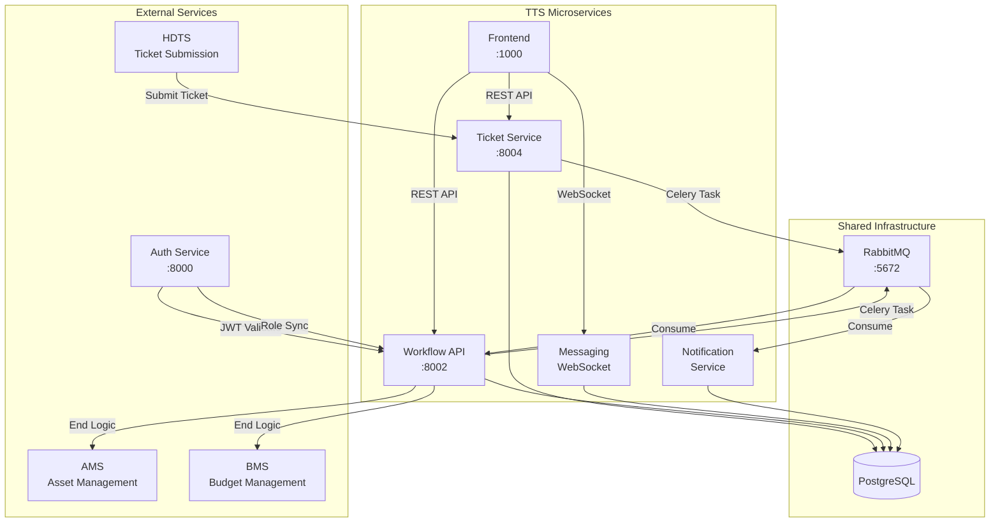
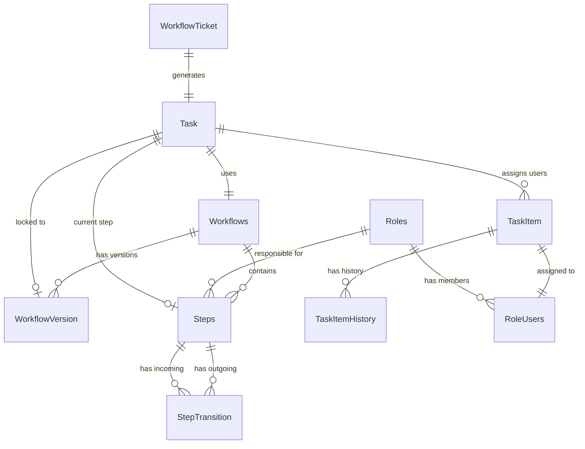

# Architecture & Tech Stack

## Executive Summary

The **Ticket Tracking System (TTS)** is a microservices-based workflow orchestration engine. It manages ticket lifecycle from submission through resolution via configurable workflows with SLA enforcement, intelligent task assignment, and comprehensive auditing.

## System Context



## Technology Stack

| Layer | Technology | Purpose |
|-------|------------|---------|
| **Framework** | Django 5.2 | Web framework |
| **API** | Django REST Framework 3.16 | RESTful endpoints |
| **Database** | PostgreSQL | Data persistence |
| **Message Broker** | RabbitMQ (AMQP) | Async task queue |
| **Task Queue** | Celery 5.5 | Background processing |
| **Real-time** | Django Channels | WebSocket support |
| **Frontend** | React + Vite | User interface |
| **Auth** | JWT (HTTP-Only Cookies) | Token authentication |
| **Docs** | drf-spectacular | OpenAPI 3.0 schema |

## Microservice Breakdown

### Ticket Service (`ticket_service/`)

Primary ticket data store and external API gateway.

| Component | Purpose |
|-----------|---------|
| **Ticket Model** | Core ticket data with flexible JSON fields |
| **Attachments** | File upload handling and storage |
| **External API** | REST endpoints for ticket CRUD |
| **Celery Tasks** | Push tickets to workflow queue |

**Port:** 8004

### Workflow API (`workflow_api/`)

Central orchestration engine - the heart of TTS.

| App | Purpose | Key Models |
|-----|---------|------------|
| **workflow** | Workflow definitions and versioning | `Workflows`, `WorkflowVersion` |
| **step** | Steps and transitions | `Steps`, `StepTransition` |
| **task** | Task execution and assignment | `Task`, `TaskItem`, `TaskItemHistory` |
| **role** | Local role cache (synced from Auth) | `Roles`, `RoleUsers` |
| **tickets** | Ticket snapshots and state | `WorkflowTicket`, `RoundRobin` |
| **audit** | Action logging | `AuditEvent` |
| **reporting** | Analytics and dashboards | Views only |

**Port:** 8002

### Messaging Service (`messaging/`)

Real-time collaboration for ticket discussions.

| Component | Purpose |
|-----------|---------|
| **Comments** | Thread-based discussions per ticket |
| **Ratings** | Thumbs up/down on comments |
| **Attachments** | Document attachments in comments |
| **WebSocket** | Real-time updates via Django Channels |

### Notification Service (`notification_service/`)

Asynchronous notification delivery.

| Component | Purpose |
|-----------|---------|
| **InAppNotification** | Persistent in-app notifications |
| **Email Tasks** | SendGrid-based email delivery |
| **Celery Workers** | Consume notification queue |

## Data Models

### Core Entity Relationships



### Workflow Model

```python
class Workflows(models.Model):
    workflow_id = models.AutoField(primary_key=True)
    user_id = models.IntegerField()           # Creator
    name = models.CharField(max_length=64, unique=True)
    description = models.CharField(max_length=256)
    
    # Categorization
    category = models.CharField(max_length=64)
    sub_category = models.CharField(max_length=64)
    department = models.CharField(max_length=64)
    
    # Status
    status = models.CharField(choices=STATUS_CHOICES, default="draft")
    is_published = models.BooleanField(default=False)
    
    # SLA per priority
    low_sla = models.DurationField(null=True)
    medium_sla = models.DurationField(null=True)
    high_sla = models.DurationField(null=True)
    urgent_sla = models.DurationField(null=True)
    
    # End logic trigger
    end_logic = models.CharField(choices=END_LOGIC_CHOICES, blank=True)
```

### Task Model

```python
class Task(models.Model):
    task_id = models.AutoField(primary_key=True)
    ticket_id = models.ForeignKey(WorkflowTicket, on_delete=models.CASCADE)
    workflow_id = models.ForeignKey(Workflows, on_delete=models.CASCADE)
    workflow_version = models.ForeignKey(WorkflowVersion, null=True)
    current_step = models.ForeignKey(Steps, null=True)
    ticket_owner = models.ForeignKey(RoleUsers, null=True)  # Ticket Coordinator
    status = models.CharField(choices=TASK_STATUS_CHOICES, default='pending')
    target_resolution = models.DateTimeField(null=True)
    resolution_time = models.DateTimeField(null=True)
```

### TaskItem Model

```python
class TaskItem(models.Model):
    task_item_id = models.AutoField(primary_key=True)
    task = models.ForeignKey(Task, on_delete=models.CASCADE)
    role_user = models.ForeignKey(RoleUsers, on_delete=models.CASCADE)
    origin = models.CharField(choices=TASK_ITEM_ORIGIN_CHOICES, default='System')
    notes = models.TextField(blank=True)
    assigned_on = models.DateTimeField(auto_now_add=True)
    assigned_on_step = models.ForeignKey(Steps, null=True)
    target_resolution = models.DateTimeField(null=True)
    acted_on = models.DateTimeField(null=True)
```

## URL Structure

### Workflow API (`workflow_api/`)

```
/                           → API Root
/admin/                     → Django Admin
/docs/                      → Swagger UI
/schema/                    → OpenAPI Schema

/workflows/                 → Workflow CRUD
/steps/                     → Step management
/transitions/               → Step transitions
/tasks/                     → Task management
/tickets/                   → Ticket snapshots
/roles/                     → Role cache

/audit/                     → Audit log endpoints
/analytics/                 → Reporting & dashboards
```

### Ticket Service (`ticket_service/`)

```
/tickets/                   → Ticket CRUD
/tickets/send/              → External submission
```

## Port Allocation

| Service | Development | Docker | Purpose |
|---------|-------------|--------|---------|
| Frontend | 1000 | 1000 | React UI |
| Auth Service | 8000 | 8000 | Identity Provider |
| Workflow API | 8002 | 8002 | Orchestration |
| Ticket Service | 8004 | 8004 | Ticket CRUD |
| RabbitMQ | 5672 | 5672 | Message broker |
| RabbitMQ UI | 15672 | 15672 | Management console |
| PostgreSQL | 5432 | 5432 | Database |

## Queue Architecture

### RabbitMQ Queues

| Queue | Producer | Consumer | Purpose |
|-------|----------|----------|---------|
| `TICKET_TASKS_PRODUCTION` | Ticket Service | Workflow API | New tickets |
| `WORKFLOW_TASKS_PRODUCTION` | Workflow API | Workflow Worker | Task processing |
| `INAPP_NOTIFICATION_QUEUE` | Workflow API | Notification Service | In-app alerts |
| `EMAIL_NOTIFICATION_QUEUE` | Workflow API | Notification Service | Email delivery |
| `TTS_ROLE_SYNC_QUEUE` | Auth Service | Workflow API | Role sync |

### Celery Task Flow

```
┌─────────────────┐    ┌─────────────────┐    ┌─────────────────┐
│ Ticket Service  │    │    RabbitMQ     │    │  Workflow API   │
│                 │    │                 │    │     Worker      │
│ push_ticket_to_ │───►│ TICKET_TASKS_   │───►│ receive_ticket  │
│ workflow.delay()│    │ PRODUCTION      │    │ (Celery Task)   │
└─────────────────┘    └─────────────────┘    └─────────────────┘
                                                      │
                                                      ▼
                                              ┌─────────────────┐
                                              │ create_task_for │
                                              │ _ticket()       │
                                              │                 │
                                              │ • Match workflow│
                                              │ • Create Task   │
                                              │ • Assign users  │
                                              └─────────────────┘
                                                      │
                                                      ▼
                                              ┌─────────────────┐
                                              │ Notification    │
                                              │ Queue           │
                                              │                 │
                                              │ Email + InApp   │
                                              └─────────────────┘
```

## Authentication Flow

1. **Token Source:** JWT stored in `access_token` HTTP-Only cookie
2. **Validation:** `JWTCookieAuthentication` middleware decodes token
3. **User Context:** Token claims provide `user_id`, `email`, `systems`, `roles`
4. **Permission Check:** `SystemRolePermission` validates role access
5. **Role Sync:** Auth Service pushes role changes via Celery queue

```python
# Example authentication setup
class TaskViewSet(viewsets.ModelViewSet):
    authentication_classes = [JWTCookieAuthentication]
    permission_classes = [IsAuthenticated, SystemRolePermission]
    required_system_roles = {'tts': ['Admin', 'Agent']}
```
